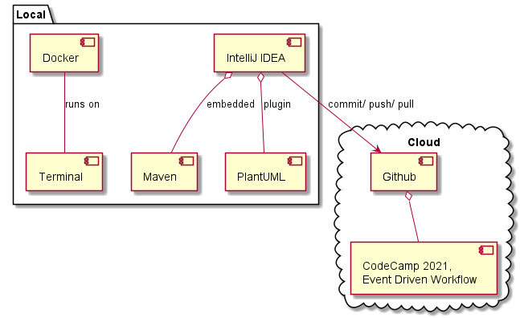

# IDE

## Overview


## Troubleshooting

### Options -Xverify:none and -noverify were deprecated in JDK 13
Starting the springboot server provides the following warning:
```
OpenJDK 64-Bit Server VM warning: Options -Xverify:none and -noverify were deprecated in JDK 13 and will likely be removed in a future release.
```
This can be solved unchecking the following checkbox in the launch configuration of your springboot application:
![Verify-Warning][Verify-Warning]

### Sharing is only supported for boot loader classes because bootstrap classpath has been appended
Starting the springboot server provides the following warning:
```
OpenJDK 64-Bit Server VM warning: Sharing is only supported for boot loader classes because bootstrap classpath has been appended
```

This can be solved unchecking the following checkbox in the preferences (searching for "async"):
![Sharing Warning][Sharing-Warning]
(see solution described in [[How to avoid "Sharing is only supported for boot loader classes because bootstrap classpath has been appended" warning during debug with Java 11?][Sharing-Warning-StackOverflow]])

[Sharing-Warning-StackOverflow]: (https://stackoverflow.com/questions/54205486/how-to-avoid-sharing-is-only-supported-for-boot-loader-classes-because-bootstra)
[Sharing-Warning]: warn-vm-sharing.png "Sharing Warning"
[Verify-Warning]: warn-vm-verify.png "Verify Warning"

