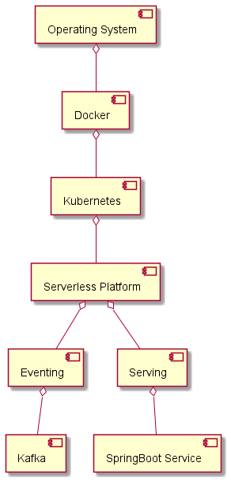

# Serverless

## Overview


## Basic Idea
- Provide validation and modification of data, or check incomming data with business rules
- Identify whether storing data on a DB is feasible or not
- May send information to a online media, like teams or slack

## Challenges
- Installation on local resources are limited, need of CPU and Memory
- Stand-by "can" kills knative running system (resouce problem)
- Knative supports Kafka, but the installation on a Kubernetes Cluster is not that easy

## Walk-Through
- Knative can trigger on events for e.g with Kafka topics..
- Knative can serve for e.g a REST endpoint
- Scaling to Zero

call the https://myurl/hello
```bash
NAME                                     READY   STATUS
hello-world                              2/2     Running
hello-world                              2/2     Terminating
hello-world                              1/2     Terminating
hello-world                              0/2     Terminating
```
recall the url https://myurl/hello
```bash
hello-world                              0/2     Pending
hello-world                              0/2     ContainerCreating
hello-world                              1/2     Running
hello-world                              2/2     Running
```
- traffic splitting for e.g. if you have a new version of your application, you can split the traffic by n% 
to the new revision of your app.

## Documentation
- https://knative.dev/docs
- https://docs.openshift.com/container-platform/4.9/serverless/serverless-getting-started.html
