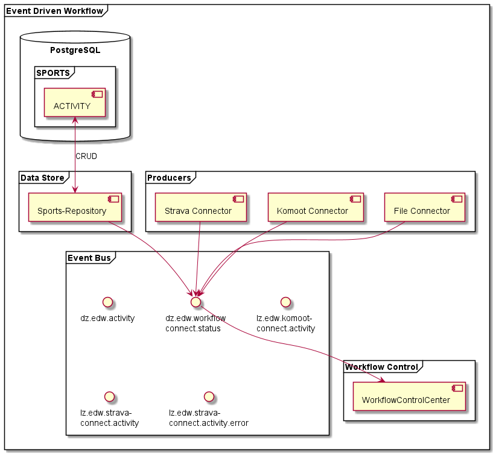

#Building Block View

## Whitebox Overall System

### Activity Flow
The following overview shows, what components are participating in the workflow of grabbing activities from a portal and
putting it in the 

### Control Flow

## Level 2

- [IDE](./05.2%20Level%202/IDE/IDE.md)